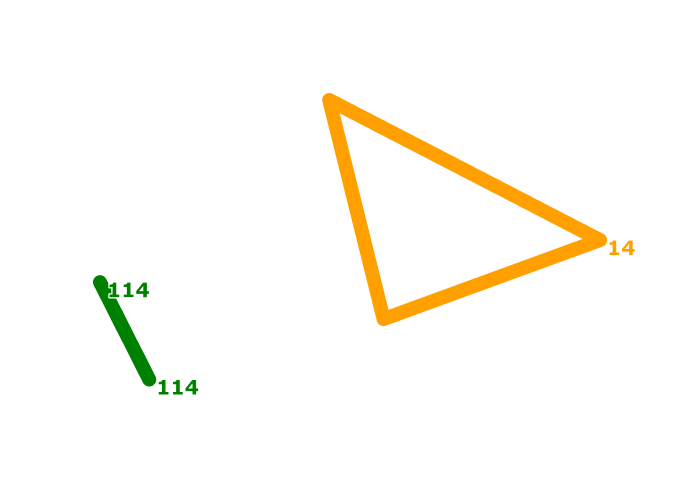

# Транспортный справочник
Интерактивная база данных (транспортный каталог) с модулями ввода/вывода данных о маршрутах и остановках в/из базы данных в формате json и рендеринга карты всех маршрутов в формате svg.

### Реализованый функционал
- Парсер JSON
- Конструктор JSON
- SVG библиотека
- Рендеринг карт маршрутов
- Поддержка цветовых палитр для отрисовки линий маршрутов
- Автоматический рендеринг цвета для маршрутов
- "Умная" база данных маршрутов и остановок
- Вычисление географических расстояний между маршрутами
- Проецирование географических координат на плоскость

### Использованные технологии
- C++ 17
- STL
- JSON
- SVG
- CMake 3.25.2

### Содержание файлов

- `domain.h` - структуры для остановок, маршрутов и информации о них
- `geo.h | .cpp` функции для расчета географических расстояний между двумя остановками
- `json.h | json.cpp` json-библиотека
- `json_builder.h | .cpp` конструктор json
- `json_reader.h | .cpp` парсер входящих json-запросов и конструктор json-ответов
- `map_renderer.h | .cpp` визуализатор карты маршрутов
- `svg.h | .cpp` библиотека svg
- `CMakeLists.txt` файл с информацией для сборки проекта с помощью CMake

### Сборка проекта
Проект можно удобно собрать с помощью CMake, используя файл CMakeLists.txt

### Руководство по использованию
1. Для начала работы с транспортным справочником необходимо создать пустую  базу данных (экземпляр класса ```TransportCatalogue```)
```C++
data_base::TransportCatalogue db;
```
2. Создать парсер (экземпляр класса ```JsonReader```), проинициализировав его созданным объектом базы данных:
```C++
json_reader::JsonReader json_reader(db); 
```
3. Программа готова к работе, далeе необходимо передать методу ```LoadJsonAndSetDB``` класса ```JsonReader``` запросы во входной поток ```std::istream&``` \
Сигнатура метода:
```C++
void LoadJsonAndSetDB(std::istream& input)
```
Пример реализации в main.cpp:
```C++
json_reader.LoadJsonAndSetDB(std::cin)
```
4. С помощью метода ```GetCompleteOutputJSON()``` класса ```JsonReader``` можно получить в выходной поток сгенерированный комплексный json-ответ, который включает в себя:
- информацию об остановке (json);
- сгенерированную карту маршрутов (формат svg);
- информацию о маршруте (json).
Сигнатура метода:
```C++
void GetCompleteOutputJSON(std::ostream& out);
```
Пример реализации в main.cpp
```C++
json_reader.GetCompleteOutputJSON(std::cout);
```

5. Основные категории запросов:
- на добавление в базу данных ```"base_requests"```
- на задание настроек карты ```"render_settings"```
- на получение информации из базы данных ```"stat_requests"```

Виды, структура и поля поддерживаемых запросов на примере из реального запроса:
```json
{

    "base_requests": [      // запрос на добавление в базу данных
        {                   // запросы - словари с полями "ключ": значение
            "type": "Bus"   // тип запроса, тут "Bus" -> информация о маршруте
            "name": "114",  // название маршрута (может быть слово или цифра)
            "stops": ["Морской вокзал", "Ривьерский мост"] // массив остановок маршрута
            "is_roundtrip": false // кольцевой (true) некольцевой (false) маршрут
        },
        {
            "type": "Stop",             // тип запроса, тут "Stop" -> информация об остановке
            "name": "Ривьерский мост",  // название остановки
            "latitude": 43.587795,      // географические координаты
            "longitude": 39.716901,
            "road_distances": {"Морской вокзал": 850} // расстояние до ближайших остановок
        }
    ],
  
    "render_settings": {            // передача свойств для рендеринга svg-карты
        "width": 600,               // ширина 
        "height": 400,              // и высота изображения в пикселях
        "padding": 50,              // отступ краёв карты от границ svg-документа
        "stop_radius": 5,           // радиус окружностей-обозначений остановок
        "line_width": 14,           // толщина линий маршрутов
        "bus_label_font_size": 20,  // размер текста названий маршрутов
        "bus_label_offset": [       // смещение надписей названий маршрутов
              7,                    // относительно координат конечной остановки (x,y)
              15
        ],
        "stop_label_font_size": 20, // размер текста названий остановок
        "stop_label_offset": [      // смещение надписей названий остановок
            7,                      // относительно координат конечной остановки (x,y)
            -3
        ],
        "underlayer_color": [  // цвет подложки под названиями остановок и маршрутов
            255,               // red (0...255)
            255,               // green (0...255)
            255,               // blue (0...255)
            0.85               // opacity (0.0 ... 1.0)
        ],
        "underlayer_width": 3, //толщина подложки под названиями остановок и маршрутов
        "color_palette": [     // цветовая палитра
            "green",           // формат задания цвета допустим как в строчном варианте
            [255, 160, 0],     // так и в виде массива (r, g, b)
            "red"
        ]
    },

    "stat_requests": {      // запрос на получение информации из базы данных
        {
            "id": 1,        // id запроса
            "type": "Map"   // запрос на рендеринг карты
        },
        {
            "id": 2,      
            "type": "Stop", // запрос информации по названию остановки
            "name": "Ривьерский мост"  
        },
        {
            "id": 3,
            "type": "Bus",  // запрос информации по названию маршрута
            "name": "114" }
    }
}
```

6. Пример использования. Возможный результат рендеринга карты (кольцевой и некольцевой маршрут).




### Планы по доработке
- Добавление функционала по ходу будущих спринтов
- Рефакторинг кода
- Обновление документации
